# Multi-Agent Explainable AI Text Classification

> **TOBB ETÜ BIL 476/573 — Data Mining Spring 2026**
>
> *Multi-Agent Explainable AI Text Classification: A Comparative Study of Classical Machine Learning and Transformer-Based Models with SHAP and LIME*

---

## Research Question

> *"Can a multi-agent architecture effectively route and classify multilingual text, and how do traditional machine learning classifiers compare to transformer-based deep learning models in terms of accuracy, F1-score, and interpretability when explained through SHAP and LIME?"*

---

## System Architecture

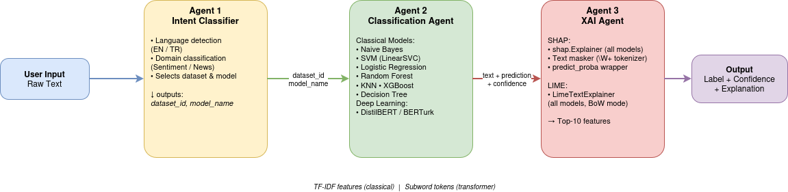

The system is built around three cooperating agents:

| Agent | Role |
|-------|------|
| **Intent Classifier** | Detects language (EN/TR) and task type (sentiment vs. topic), routes input to the correct dataset-specific classifier |
| **Classification Agent** | Runs inference with the selected model (one of 8 classifiers), returns the predicted label and confidence |
| **XAI Agent** | Generates a SHAP or LIME explanation for the prediction on demand, formats it for display |

---

## Agent Workflow

### Agent 1 — Intent Classifier (routing)
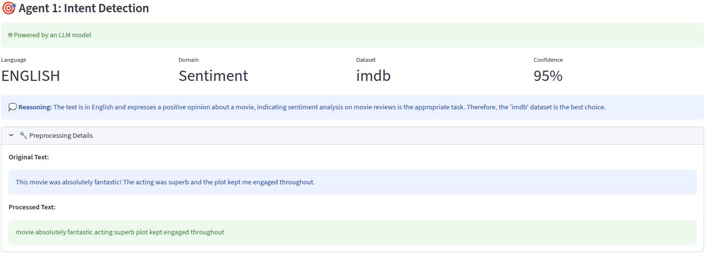

### Agent 2 — Classification Agent (inference)
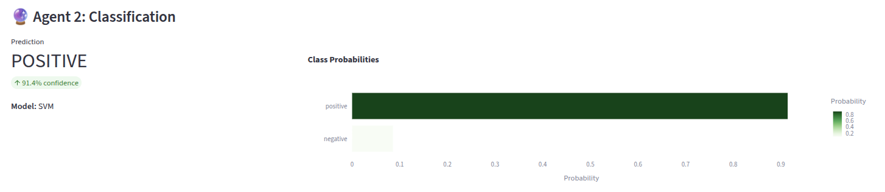

### Agent 3 — XAI Agent (explanation)
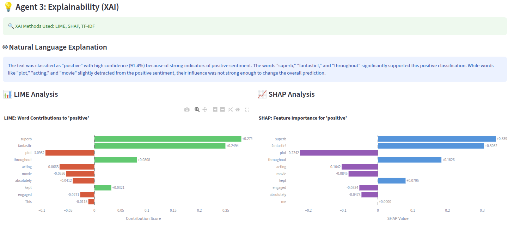

### End-to-end: classify a text
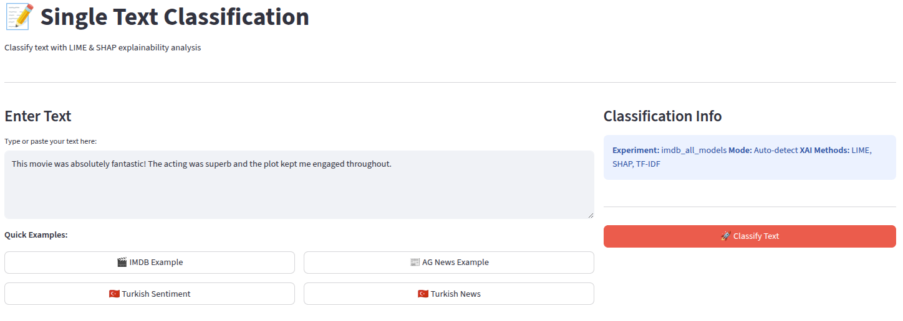

### TF-IDF feature inspection
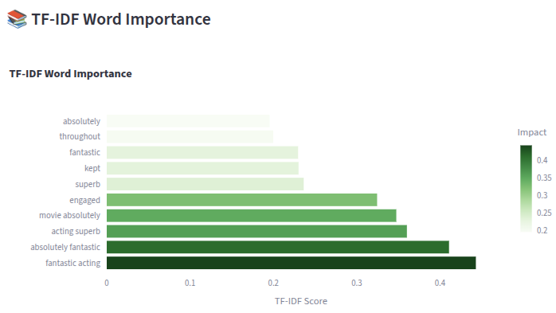

---

## Datasets

| Dataset | Language | Task | Train | Test | Classes | Balance |
|---------|----------|------|------:|-----:|:-------:|---------|
| [IMDB](https://huggingface.co/datasets/stanfordnlp/imdb) | English | Sentiment | 25,000 | 25,000 | 2 | Balanced |
| [AG News](https://huggingface.co/datasets/sh0416/ag_news) | English | Topic | 120,000 | 7,600 | 4 | Balanced |
| [Turkish Sentiment](https://huggingface.co/datasets/winvoker/turkish-sentiment-analysis-dataset) | Turkish | Sentiment | 440,679 | 48,965 | 3 | **Imbalanced** |
| [Turkish News (TTC4900)](https://huggingface.co/datasets/savasy/ttc4900) | Turkish | Topic | 3,920 | 980 | 7 | Balanced |

---

## Models

8 classifiers compared on every dataset:

| # | Model | Type |
|---|-------|------|
| 1 | DistilBERT / BERTurk | Transformer |
| 2 | Support Vector Machine (SVM) | Classical |
| 3 | Logistic Regression | Classical |
| 4 | Naive Bayes | Classical |
| 5 | Random Forest | Classical |
| 6 | XGBoost | Classical |
| 7 | K-Nearest Neighbors (KNN) | Classical |
| 8 | Decision Tree | Classical |

---

## Results

### Cross-Dataset Summary (F1-Macro / Macro AUC)

| Model | IMDB F1 | IMDB AUC | AG News F1 | AG News AUC | Tr. Sent. F1 | Tr. Sent. AUC | Tr. News F1 | Tr. News AUC |
|-------|--------:|---------:|-----------:|------------:|-------------:|--------------:|------------:|-------------:|
| **Transformer** | **.907** | **.968** | **.928** | **.989** | **.930** | **.991** | **.938** | **.994** |
| SVM | .895 | .961 | .915 | .982 | .877 | .975 | .919 | .993 |
| Logistic Regression | .894 | .960 | .909 | .981 | .839 | .974 | .887 | .988 |
| Naive Bayes | .864 | .938 | .904 | .979 | .849 | .967 | .899 | .993 |
| Random Forest | .861 | .938 | .880 | .975 | .789 | .962 | .843 | .978 |
| XGBoost | .857 | .936 | .873 | .969 | .755 | .926 | .834 | .976 |
| KNN | .729 | .793 | .891 | .969 | .776 | .922 | .884 | .968 |
| Decision Tree | .733 | .776 | .611 | .834 | .706 | .828 | .491 | .783 |

**Key findings:**
- Transformer is best on all four datasets; the gap over SVM ranges from **1.2 to 5.3 points**.
- SVM is the best classical model everywhere — trains in 0.4–2.6 s while finishing within 1.9 pts of the transformer on 3/4 datasets.
- Decision Tree collapses on multiclass tasks: 73.3% on binary IMDB → 49.1% on 7-class Turkish News (barely above random).
- KNN performs surprisingly well on short-text balanced datasets (89.1% on AG News).
- Class imbalance in Turkish Sentiment penalises all models; SVM loses 4.5 pp from Accuracy to F1-Macro, DT loses 8.7 pp.

---

### IMDB (Binary Sentiment — English)

| | Overall | F1 Scores | ROC Curves | Confusion Matrices | Training Time |
|--|:-------:|:---------:|:----------:|:-----------------:|:-------------:|
| | 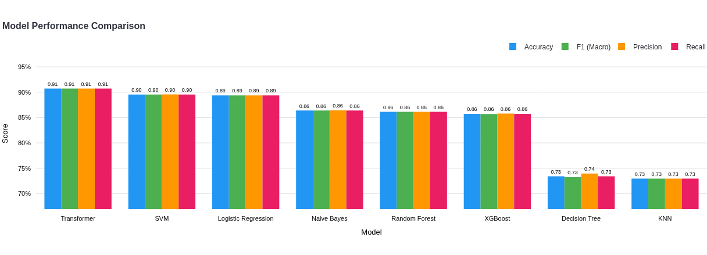 | 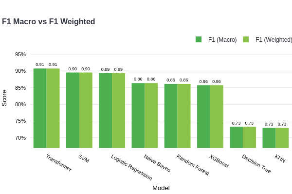 | 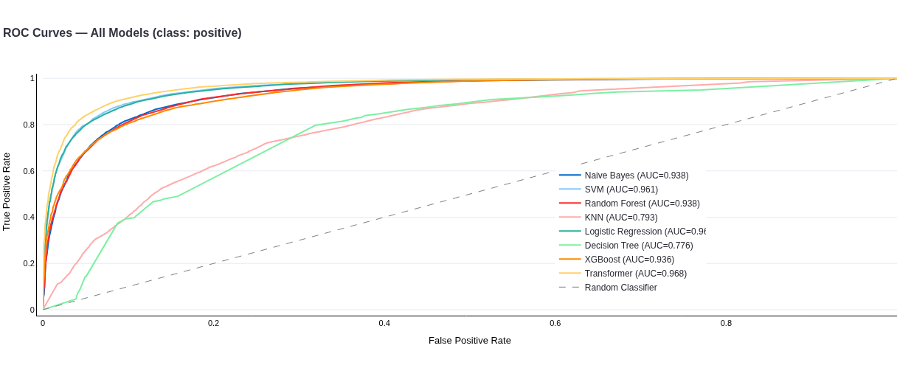 | 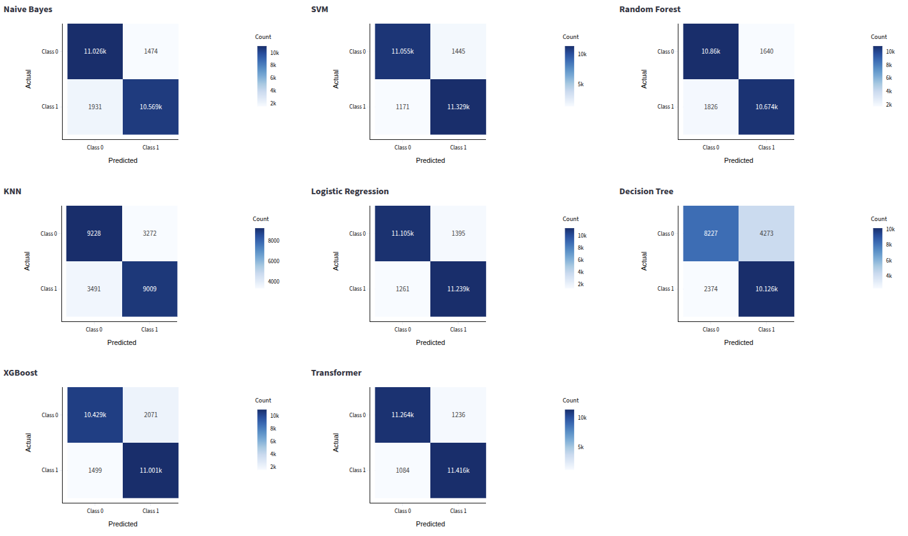 | 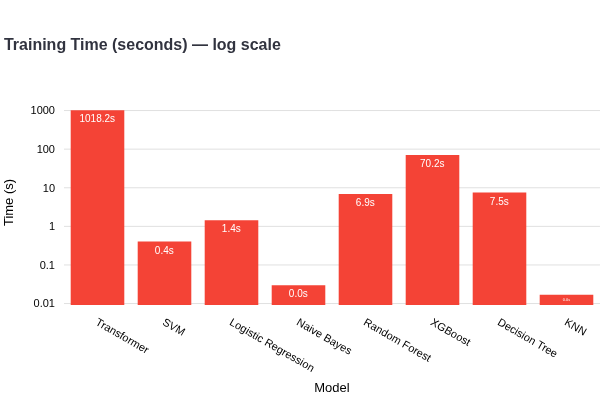 |

---

### AG News (4-class Topic — English)

| | Overall | F1 Scores | ROC Curves | Confusion Matrices | Training Time |
|--|:-------:|:---------:|:----------:|:-----------------:|:-------------:|
| | 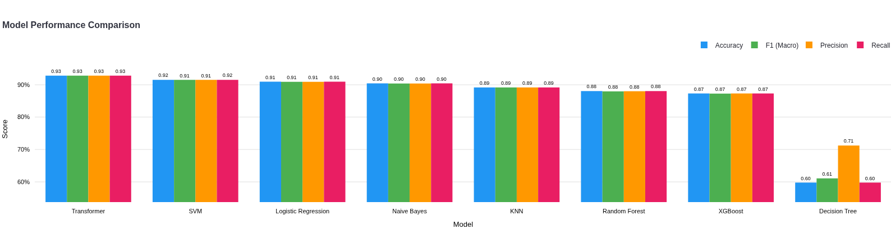 | 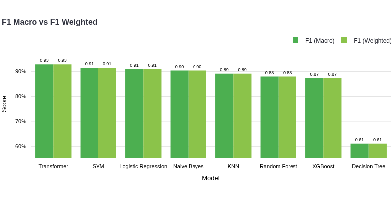 | 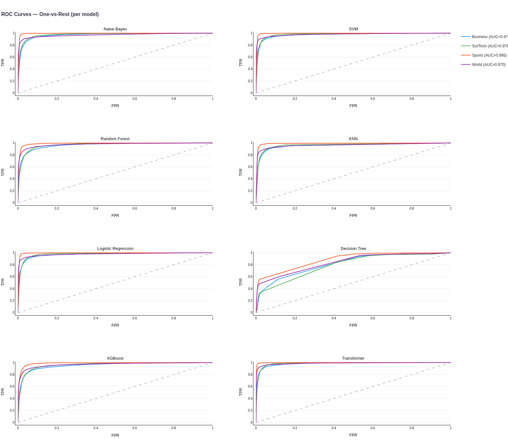 | 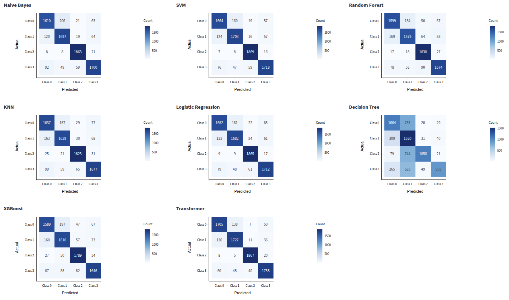 | 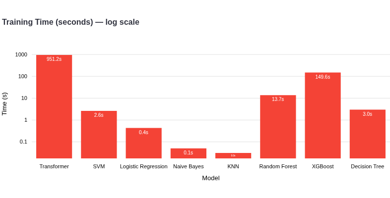 |

---

### Turkish Sentiment (3-class, Imbalanced)

| | Overall | F1 Scores | ROC Curves | Confusion Matrices | Training Time |
|--|:-------:|:---------:|:----------:|:-----------------:|:-------------:|
| | 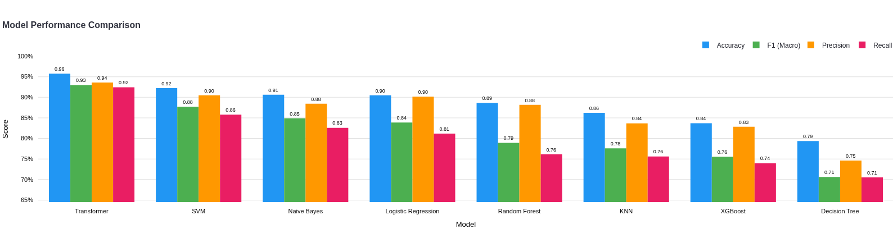 | 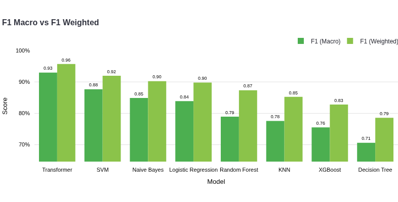 | 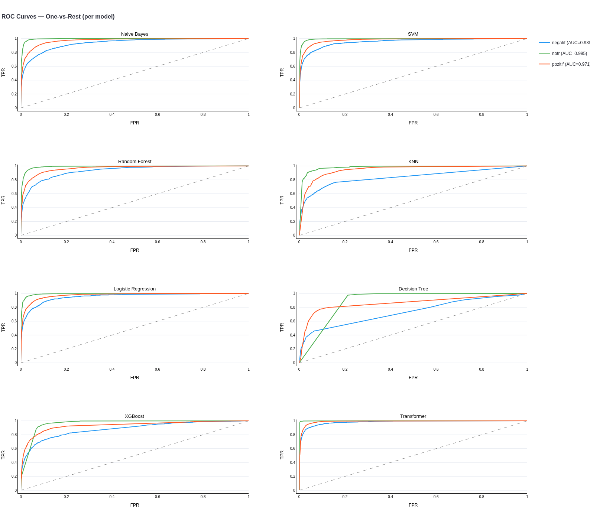 | 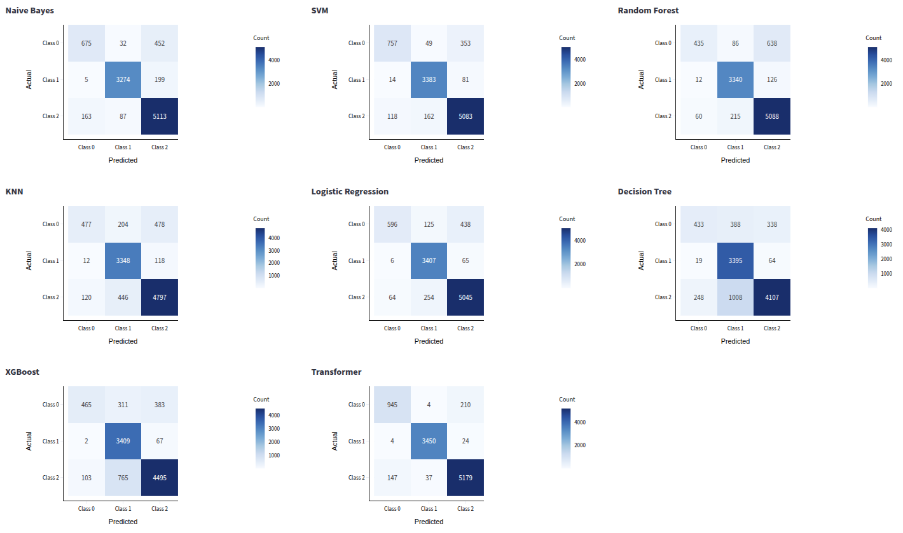 | 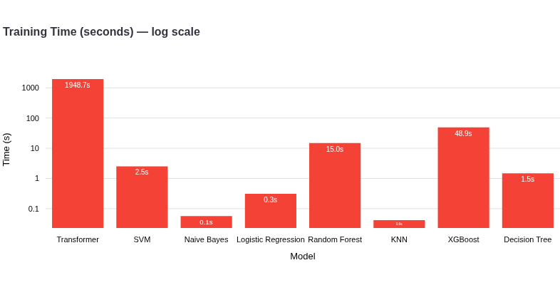 |

---

### Turkish News / TTC4900 (7-class Topic — Turkish)

| | Overall | F1 Scores | ROC Curves | Confusion Matrices | Training Time |
|--|:-------:|:---------:|:----------:|:-----------------:|:-------------:|
| | 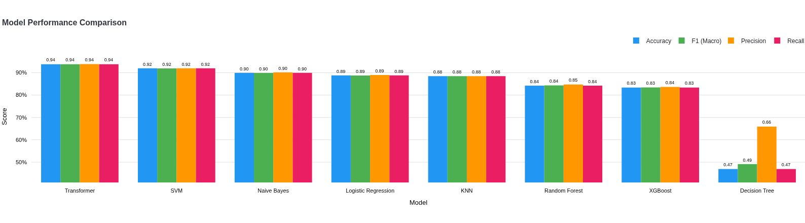 | 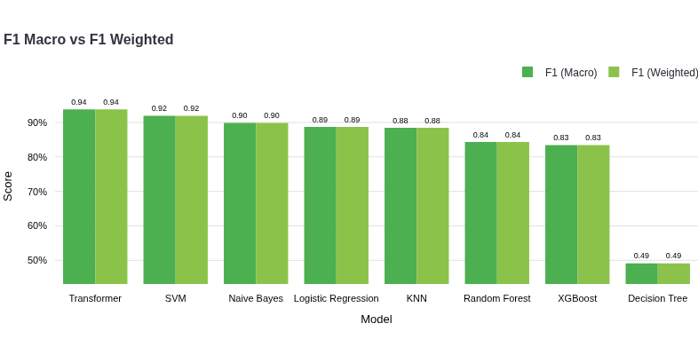 | 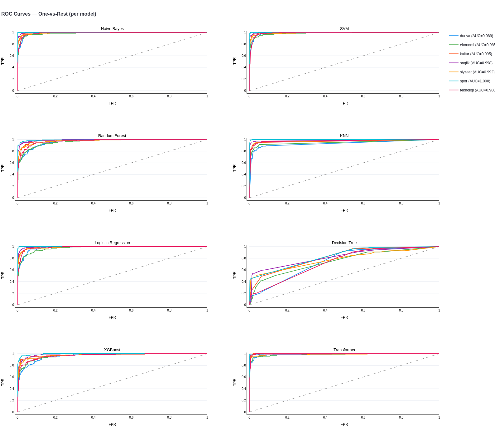 | 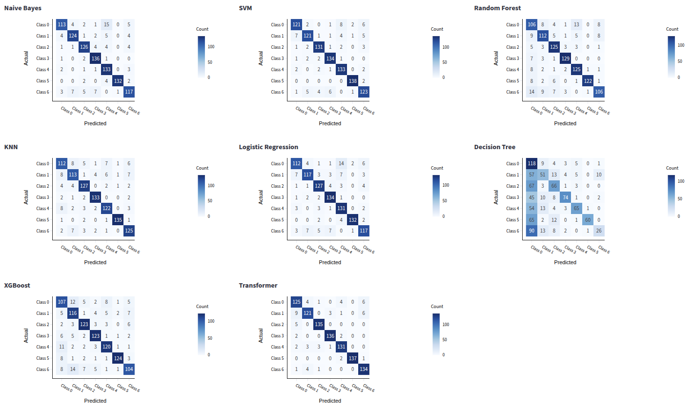 | 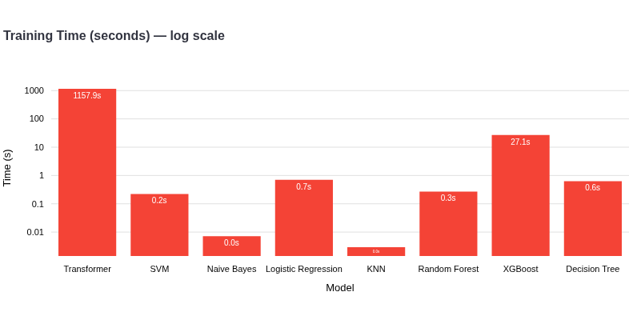 |

---

## Setup & Usage

### 1. Create and activate the environment

```bash
conda env create -f environment.yml
conda activate xai-classifier
```

### 2. Train models

```bash
python scripts/train_experiment.py --config configs/imdb.yaml
python scripts/train_experiment.py --config configs/ag_news.yaml
python scripts/train_experiment.py --config configs/turkish_sentiment.yaml
python scripts/train_experiment.py --config configs/turkish_news.yaml
```

### 3. Launch the Streamlit app

```bash
streamlit run app/Home.py
```

The app includes six pages:

| Page | Description |
|------|-------------|
| 📝 Classify Text | Single-text inference with SHAP/LIME explanation |
| 📊 Batch Processing | Upload CSV, classify in bulk |
| ⚖️ Model Comparison | Compare all 8 models side-by-side |
| 📚 Dataset Explorer | Browse and filter dataset samples |
| 📋 Experiment Details | View training metrics and plots |
| 🎓 Train Models | Trigger training from the UI |

---

## Project Structure

```
├── app/                   # Streamlit UI (Home.py + 6 pages)
├── configs/               # YAML experiment configs per dataset
├── data/                  # Raw and processed data
├── notebooks/             # Exploratory analysis
├── reports/
│   └── pattern_recognition/       # IEEE paper (sample_report.tex/.pdf)
│       ├── imdb/          # IMDB result plots
│       ├── ag_news/       # AG News result plots
│       ├── turkish_sentiment/
│       ├── turkish_news/
│       └── examples/      # App screenshots
├── scripts/               # Training and evaluation scripts
├── src/
│   ├── agents/            # intent_classifier, classification_agent, xai_agent
│   ├── data/              # Dataset loaders
│   ├── explainability/    # SHAP & LIME wrappers
│   ├── models/            # Model definitions
│   ├── preprocessing/     # Text cleaning & TF-IDF pipeline
│   └── pipeline.py        # End-to-end pipeline
├── environment.yml
└── main.py
```

---

## Report

The full IEEE-format paper is at [`reports/pattern_recognition/211101023_OrucCakir_BIL443_report.tex`](reports/pattern_recognition/211101023_OrucCakir_BIL443_report.tex).

PDF: [`reports/pattern_recognition/211101023_OrucCakir_BIL443_report.pdf`](reports/pattern_recognition/211101023_OrucCakir_BIL443_report.pdf).
